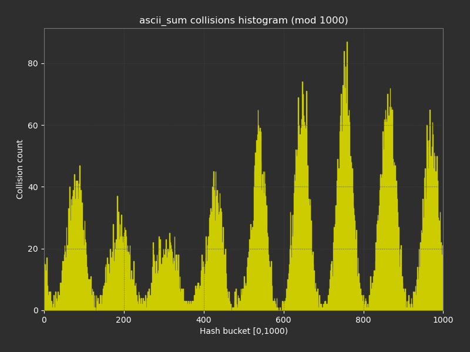

# Лабораторная работа по оптимизации хеш-таблицы

## Теория

### Хеш-функция
Хеш-функция — это отображение $h: U \rightarrow [0, m - 1]$, которая для произвольного ключа возвращает целое хеш в диапазоне от $0$ до $m-1$. 

### Требования к хеш-функции  
- **Детерминированность**
  - Одинаковые ключи всегда дают одинаковый результат.  
- **Равномерное распределение**  
  - Хеши распределяются равномерно по диапазону $[0, m-1]$.
- **Эффективность**  

Коллизия происходит, когда значение хеш-функции от разных ключей совпадает, то есть $x \neq y \: h(x) = h(y)$.

### Хеш-таблица

#### Методы разрешения коллизий
- Открытая адресация
  - При возникновении колиции выполняем операцию пробы: пытаемся пойти дальше и положить элемент,
- Идеальное хеширование
- Метод цепочек

Хеш-таблица с цепочками — это структура данных, реализующая ассоциативный массив, в которой коллизии обрабатываются при помощи связных списков.

- **Массив бакетов**  
  - Таблица представляет собой массив $T$ из $m$ элементов (бакетов).  
- **Цепочки**  
  - В каждом бакете хранится указатель на начало связного списка всех элементов, у которых функция $h(key)$ дала этот индекс.  

Определим коэффициент заполнения (load factor) $\alpha$ таблицы $Т$ как $\frac{n}{m}$, где $n$ - количество, хранящихся элементов в таблице, $m$ - количество бакетов.

#### Асимптотика

| Операция   | Амортизированное время |
|------------|------------------------|
| Поиск      | $\Theta(1)$            |
| Вставка    | $\Theta(1)$            |
| Удаление   | $\Theta(1)$            |

- В худшем случае (все ключи в одной цепочке) сложность операций деградирует до $O(n)$.


## Выбор хеш-функции
Кандидаты:
 - Длина строки
 - Сумма ASCII-значений символов
 - Полиномиальный хеш
 - crc32

Дисперсия расчитывалась по формуле $\mathbb{D}\xi = \mathbb{E}(\xi ^ 2) - (\mathbb{E}\xi)^2$


| Хеш		 | Дисперсия		|
|----------------|----------------------|
| Длина		 |  44908		|
| Сумма ASCII    |  342			|
| Полиномиальный |  22			|
| crc32		 |  20			|


<table>
  <tr>
    <td align="center"><p> Рис. 1. Длина строки</p></td>
    <td align="center"><p> Рис. 2. Сумма ASCII-кодов</p></td>
  </tr>
  <tr>
    <td align="center"><p> Рис. 3. Полиномиальный хеш</p></td>
    <td align="center"><p> Рис. 4. CRC32</p></td>
  </tr>
</table>

Лучшими оказались `crc32` и полиномиальный хеш. Выберем `crc32` - ведь на X86 (в процессорах с набором инструкций SSE4.2) есть аппаратная поддержка данного хеша.

## Задача
Задача оптимизировать хеш-таблицу с завышенным коэффициентом заполнения. Установим размер таблицы $m \approx 1000$, чтобы load factor приблизился к $\alpha \approx 15$. В таблице будем хранить пару `слово:кол-во вхождений`. Будем загружать в хеш-таблицу произведение "Война и Мир" и в целях тестирования производительности поиска будем осуществлять $50 \cdot 10 ^ 6$ операций поиска в таблице.

<table>
  <tr>
    <td align="center">Всего слов</td>
    <td align="center">Уникальных слов</td>
  </tr>
  <tr>
    <td align="center">$562241$</td>
    <td align="center">$20741$</td>
  </tr>
</table>

## Тестовая машина
 - `12th Gen Intel(R) Core(TM) i7-12700H` (с поддержкой `avx2`)
   - Установлена частота $4.6$ ГГц на ядре #1
   - Включены митигации Spectre
 - Память 16 GB 6400 MT/s LPDDR5 
 - Подключено зарядное устройство
 - ОС Arch Linux с ядром 6.14.5-arch1-1
   - Выполняется на ядре #1 (p-core) в realtime-режиме

Отчёт `cpupower`
```
CPU 1:
  hardware limits: 400 MHz - 4.60 GHz
  current CPU frequency: 4.6 GHz (asserted by call to kernel)	
```

## Профилирование и оптимизации
### Исходная программа
<table>
  <tr>
    <td align="center"><p> Рис. 5. Отчет профилировщика 1</p></td>
  </tr>
</table>

Видим, что `strcmp` занимает бОльшую часть времени выполнения программы. Это и будет первой оптимизацией.

### Использование типа `__m256`.
Поскольку максимальная длина слова в английском переводе "Война и мир" не превышает $32$ символа (т.е. $256$ бит), то мы можем хранить слова в SIMD типе `__m256`, что сильно ускорит время работы.

#### Новая `strcmp`
Для работы с такими строками реализуем свою версию `strcmp` для `__mm256`. Просто используем встроенную инструкцию побайтового сравнения. Здесь решил использовать inline-assembly, ведь тут очень короткая функция.
```c
unsigned int mask;
__asm__ volatile("vpcmpeqb %[b], %[a], %%ymm0\n\t"
		 "vpmovmskb %%ymm0, %[mask]\n\t"
		 : [mask] "=r"(mask)
		 : [a] "x"(a), [b] "x"(b)
		 : "ymm0");

return unlikely(mask == 0xFFFFFFFFu);
```

Используем интринзики, чтобы подгрузить строчку в ymm-регистр для дальнейшего использования.
Указано выравнивание по 32 для ускорения операции load.
```c
__m256i get_ymm_key(char *key, size_t len)
{
	__attribute__((aligned(32))) char aligned_buf[AVX_WORD_SZ] = {};
	memcpy(aligned_buf, key, len % AVX_WORD_SZ);				// компилятор видит, что длина строки меньше 32 -- будет использовать AVX2 инструкции.

	__m256i key_ymm = _mm256_load_si256((__m256i const *)aligned_buf);
	return key_ymm;
}
```

Эти оптимизации в совокупности дали прирост производительности в $1.56 \pm 0.14$ раза.

#### Дальнейшая оптимизация хеша
<table>
  <tr>
    <td align="center"><p> Рис. 6. Отчет профилировщика 2</p></td>
  </tr>
</table>

Выбор очевиден -- необходимо оптимизировать хеш.

### CRC32
В X86 процессорах с набором инструкций `SSE4.2` и выше существует инструкция `crc32`, которая вычисляет данный хеш намного быстрее, чем обычная реализация на C. 
Переделаем нашу реализацию `crc32`, чтобы она использовала одноимённую инструкцию. Не забываем, что слова помещаются в ymm-регистр. 
```asm
hash_crc32:
	push    rbp
	mov     rbp, rsp
	sub     rsp, 32

	vmovdqu ymm0, [rsp]

	mov     rax, 0FFFFFFFFh

	lea     rsi, [rsp]
	crc32   rax, qword [rsi]        ; bytes  0– 7
	crc32   rax, qword [rsi +  8]   ; bytes  8–15
	crc32   rax, qword [rsi + 16]   ; bytes 16–23
	crc32   rax, qword [rsi + 24]   ; bytes 24–31

	not     eax

	leave
	ret
```

Замеры производительности показали, что оптимизированная реализация работает в $1.76 \pm 0.03$ раза быстрее, по сравнению с предыдущей реализацией. 

### Остальное

<table>
  <tr>
    <td align="center"><p> Рис. 7. Отчет профилировщика 3</p></td>
  </tr>
</table>

Далее оптимизировать эти функции SIMD-инструкциями не получается -- компилятор оптимально реализовал эти функции.
На этом этапе исправлено выравнивание (по размеру кеш-линии по 64 байта), добавлены подсказки ветвлений и кеш-префетчи.
Но, к сожалению, измеримого прироста производительности эти оптимизации не дали.

## Результаты
Результаты тестов, после $30$ итераций.
Оценивались по следующим формулам:
$\bar{x} = \frac{1}{N} \sum_{i=1}^N {x_i}$
$\sigma = \frac{\sqrt{\frac{1}{N-1} \sum_{i=1}^N \bigl(x_i - \bar x\bigr)^2}}{\sqrt{N}}$

 - Оптимизированная хеш-таблица (среднее):  $391.4 \pm 0.9$ ms
 - Наивная реализация (среднее):    $1.099 \pm 0.110$ s

Оптимизированная версия получилась в $2.81 \pm 0.28$ раза быстрее чем исходная реализация.

**КПД:** $\alpha = \frac{\text{коэф. ускорения}}{\text{кол-во строк asm-кода}} = \frac{2.81}{19} \approx 0.15$.

## Литература
1.	Кормен Т. Х., Лейзерсон Ч. Э., Ривест Р. Л., Штайн К. В.  
	Алгоритмы. Построение и анализ. — 3-е изд. — Санкт-Петербург: Питер, 2013. — 1232 с.  
	(ориг. “Introduction to Algorithms”, MIT Press, 2009)
2.	Полиномиальное хеширование: [Электронный ресурс]. URL: https://ru.algorithmica.org/cs/hashing/polynomial/ 
	(Дата обращения 28.04.2025)
3.	Perf Examples: [Электронный ресурс]. URL: https://www.brendangregg.com/perf.html
	(Дата обращения 28.04.2025)

